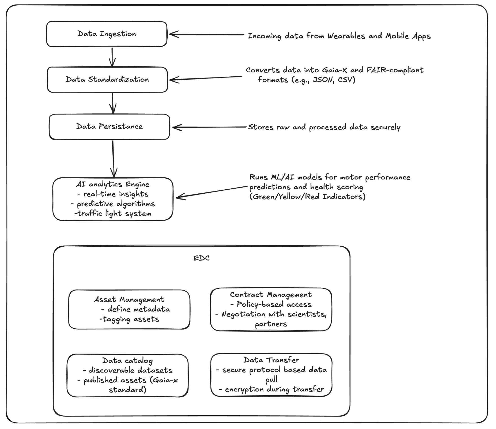

# ExpandAI demonstrator

<a href="https://www.expandai.de" target="_blank"><br/>www.expandai.de</a>

## Demonstrator overview

The goal of this demonstrator is a secure and legally compliant method to collect and manage data from various wearable sensor sources (e.g. smartphone and smartwatch), which can then be used to train AI algorithms. The prototype focuses on integrating AI-based DiGAs into the healthcare ecosystem by adhering to the FAIR (Find ability, Accessibility, Interoperability, and Reusability) and Gaia-X principles. These guidelines ensure that data management is transparent, accessible, and fair. The ability to gather and analyze data about health conditions and influencing factors is crucial for developing new therapies and holistic care strategies.


At the core of this project is a data integration center, which gathers and standardizes Parkinson patient data from a smartphone (iPhone 12 Pro Max) and smartwatch (Apple Watch Series 8). AI analytics within the center enable near real-time data insights, supporting Parkinson healthcare professionals and researchers in decision-making and advancing medical research. Our prototype proposes a framework for secure data exchange between scientific institutions and industry partners. This collaboration can empower healthcare providers to monitor Parkinson patient health using a simple traffic light system to indicate their condition: green for well, yellow for unwell but not critical, and red for emergencies. This system will be accessible via a web platform for doctors, providing valuable insights while minimizing data sharing. Moreover, limited access to these databases for companies developing DiGAs could enhance AI model training and product development, ultimately advancing personalized healthcare and improving patient outcomes.

## DiGA Overview:

DiGA (Digitale Gesundheitsanwendung, or “Digital Health Application”) is a certified digital tool in Germany designed to help patients manage, treat, or prevent medical conditions.

- Medical Purpose:
  DiGAs are intended for the diagnosis, treatment or prevention of diseases. Examples include apps for managing diabetes, mental health disorders, chronic pain, or Parkinson.
- Regulatory Approval:
  To qualify as a DiGA, the app must be approved by Germany’s Federal Institute for Drugs and Medical Devices. This ensures the app meets strict criteria for quality, safety, and data protection.
- Evidence-Based:
  DiGAs must demonstrate measurable positive effects through scientific studies.
- Reimbursement by Health Insurers:
  Once approved, DiGAs can be prescribed by doctors and are paid by health insurance providers in Germany. Which is very profitable for companies.

## Usefull links:

- [Wiki](https://fair-ds4nfdi.github.io/wiki/expandAI.html)
- [App production](https://fit-ds-6bbf0eea348a.herokuapp.com/?sort=id,asc)
- [Architecture](https://app.diagrams.net/#Hrobertp1994%2Ffair-ds-diga%2Fmain%2FdigaC4.drawio)
- [CI/CD](https://github.com/robertp1994/fair-ds-diga/actions)
- [Other documentation](.documentation/)

## Data

We used only data generated using GAN (Generative Adversarial Network).
We did not utilize any real patient data, but it was inspired by project ParkProReakt that we also worked on.

## Dashboard

The dashboard provides a clear, organized interface for displaying both results and finger-tap data, offering insights
into patient motor performance.
The use of visual elements like charts and traffic lights effectively communicates the data trends and potential areas
of concern. The chart highlights key metrics, thumb and digit movements over time, allowing users to track progress or
deterioration. The traffic light system adds a simple yet powerful tool for quick assessments, signaling performance
status with an intuitive red-yellow-green scheme.


## Data Integration Center



## Role of EDC

The Eclipse Dataspace Connector EDC powered by Sovity enables secure compliant and FAIR data exchange for Parkinson’s healthcare data collected from smartphones and smartwatches It facilitates data discovery policy enforcement and secure transfer adhering to GDPR and ethical standards

Key features include data discovery where patient health metrics such as UPDRS and MoCA are made discoverable as metadata in the EDC catalog policy management which defines access rules to control who can use the data and under what conditions enabling controlled access for AI training research and clinical decisions and secure data transfer using the Consumer PULL workflow for compliant and efficient data retrieval Interoperability is ensured through the use of standard APIs and data formats making the system compatible with diverse platforms

The EDC aligns with FAIR principles by ensuring findability through indexed metadata accessibility via controlled access policies interoperability through standardized frameworks and reusability by providing anonymized datasets for use in AI training and clinical research

By integrating the EDC into the data integration center the demonstrator enhances the ability to securely manage and standardize patient data enabling real time clinical insights and advancing AI based healthcare solutions This creates a scalable FAIR compliant data exchange ecosystem that bridges healthcare providers researchers and industry partners fostering innovation and collaboration in healthcare

## Technologies used

The FAIR data space enables information exchange between research and industry organizations.

- Java 17
- Spring Boot 3.3.1
- React
- Gaia-x standards
- Docker
- Github
- REST and OpenAPI
- Heroku

This application was generated using JHipster 8.6.0, you can find documentation and help at [https://www.jhipster.tech/documentation-archive/v8.6.0](https://www.jhipster.tech/documentation-archive/v8.6.0).

## Project Structure

Node is required for generation and recommended for development. `package.json` is always generated for a better development experience with prettier, commit hooks, scripts and so on.

In the project root, JHipster generates configuration files for tools like git, prettier, eslint, husky, and others that are well known, and you can find references in the web.

`/src/*` structure follows default Java structure.

- `.yo-rc.json` - Yeoman configuration file
  JHipster configuration is stored in this file at `generator-jhipster` key. You may find `generator-jhipster-*` for specific blueprints configuration.
- `.yo-resolve` (optional) - Yeoman conflict resolver
  Allows to use a specific action when conflicts are found skipping prompts for files that matches a pattern. Each line should match `[pattern] [action]` with pattern been a [Minimatch](https://github.com/isaacs/minimatch#minimatch) pattern and action been one of skip (default if omitted) or force. Lines starting with `#` are considered comments and are ignored.
- `.jhipster/*.json` - JHipster entity configuration files

- `npmw` - wrapper to use locally installed npm.
  JHipster installs Node and npm locally using the build tool by default. This wrapper makes sure npm is installed locally and uses it avoiding some differences different versions can cause. By using `./npmw` instead of the traditional `npm` you can configure a Node-less environment to develop or test your application.
- `/src/main/docker` - Docker configurations for the application and services that the application depends on

## Development

The build system will install automatically the recommended version of Node and npm.

We provide a wrapper to launch npm.
You will only need to run this command when dependencies change in [package.json](package.json).

```
./npmw install
```

We use npm scripts and [Webpack][] as our build system.

In order to run app localy start postgresql docker container:
`docker compose -f postgresql.yml up -d --force-recreate`

Run the following commands in two separate terminals to create a blissful development experience where your browser
auto-refreshes when files change on your hard drive.

```
./mvnw
./npmw start
```

Npm is also used to manage CSS and JavaScript dependencies used in this application. You can upgrade dependencies by
specifying a newer version in [package.json](package.json). You can also run `./npmw update` and `./npmw install` to manage dependencies.
Add the `help` flag on any command to see how you can use it. For example, `./npmw help update`.

The `./npmw run` command will list all the scripts available to run for this project.

### Managing dependencies

For example, to add [Leaflet][] library as a runtime dependency of your application, you would run following command:

```
./npmw install --save --save-exact leaflet
```

To benefit from TypeScript type definitions from [DefinitelyTyped][] repository in development, you would run following command:

```
./npmw install --save-dev --save-exact @types/leaflet
```

Then you would import the JS and CSS files specified in library's installation instructions so that [Webpack][] knows about them:
Note: There are still a few other things remaining to do for Leaflet that we won't detail here.

For further instructions on how to develop with JHipster, have a look at [Using JHipster in development][].

## Building for production

To deploy app to heroku run:
`jhipster heroku`

https://www.jhipster.tech/documentation-archive/v8.6.0/heroku/

### Packaging as jar

To build the final jar and optimize the fit application for production, run:

```
./mvnw -Pprod clean verify
```

This will concatenate and minify the client CSS and JavaScript files. It will also modify `index.html` so it references these new files.
To ensure everything worked, run:

```
java -jar target/*.jar
```

Then navigate to [http://localhost:8080](http://localhost:8080) in your browser.

Refer to [Using JHipster in production][] for more details.

### Packaging as war

To package your application as a war in order to deploy it to an application server, run:

```
./mvnw -Pprod,war clean verify
```

### JHipster Control Center

JHipster Control Center can help you manage and control your application(s). You can start a local control center server (accessible on http://localhost:7419) with:

```
docker compose -f src/main/docker/jhipster-control-center.yml up
```

## Testing

### Spring Boot tests

To launch your application's tests, run:

```
./mvnw verify
```

### Client tests

Unit tests are run by [Jest][]. They're located in [src/test/javascript/](src/test/javascript/) and can be run with:

```
./npmw test
```

## Others

### Code quality using Sonar

Sonar is used to analyse code quality. You can start a local Sonar server (accessible on http://localhost:9001) with:

```
docker compose -f src/main/docker/sonar.yml up -d
```

Note: we have turned off forced authentication redirect for UI in [src/main/docker/sonar.yml](src/main/docker/sonar.yml) for out of the box experience while trying out SonarQube, for real use cases turn it back on.

You can run a Sonar analysis with using the [sonar-scanner](https://docs.sonarqube.org/display/SCAN/Analyzing+with+SonarQube+Scanner) or by using the maven plugin.

Then, run a Sonar analysis:

```
./mvnw -Pprod clean verify sonar:sonar -Dsonar.login=admin -Dsonar.password=admin
```

If you need to re-run the Sonar phase, please be sure to specify at least the `initialize` phase since Sonar properties are loaded from the sonar-project.properties file.

```
./mvnw initialize sonar:sonar -Dsonar.login=admin -Dsonar.password=admin
```

Additionally, Instead of passing `sonar.password` and `sonar.login` as CLI arguments, these parameters can be configured from [sonar-project.properties](sonar-project.properties) as shown below:

```
sonar.login=admin
sonar.password=admin
```

For more information, refer to the [Code quality page][].

### Using Docker to simplify development (optional)

You can use Docker to improve your JHipster development experience. A number of docker-compose configuration are available in the [src/main/docker](src/main/docker) folder to launch required third party services.

For example, to start a postgresql database in a docker container, run:

```
docker compose -f src/main/docker/postgresql.yml up -d
```

To stop it and remove the container, run:

```
docker compose -f src/main/docker/postgresql.yml down
```

You can also fully dockerized your application and all the services that it depends on.
To achieve this, first build a docker image of your app by running:

```
npm run java:docker
```

Or build an arm64 docker image when using an arm64 processor os like macOS with M1 processor family running:

```
npm run java:docker:arm64
```

Then run:

```
docker compose -f src/main/docker/app.yml up -d
```

When running Docker Desktop on macOS Big Sur or later, consider enabling experimental `Use the new Virtualization framework` for better processing performance ([disk access performance is worse](https://github.com/docker/roadmap/issues/7)).

For more information refer to [Using Docker and Docker-Compose][], this page also contains information on the docker-compose sub-generator (`jhipster docker-compose`), which is able to generate docker configurations for one or several JHipster applications.

## Continuous Integration

To configure CI for your project, run the ci-cd sub-generator (`jhipster ci-cd`), this will let you generate configuration files for a number of Continuous Integration systems. Consult the [Setting up Continuous Integration][] page for more information.

[JHipster Homepage and latest documentation]: https://www.jhipster.tech
[JHipster 8.6.0 archive]: https://www.jhipster.tech/documentation-archive/v8.6.0
[Using JHipster in development]: https://www.jhipster.tech/documentation-archive/v8.6.0/development/
[Using Docker and Docker-Compose]: https://www.jhipster.tech/documentation-archive/v8.6.0/docker-compose
[Using JHipster in production]: https://www.jhipster.tech/documentation-archive/v8.6.0/production/
[Running tests page]: https://www.jhipster.tech/documentation-archive/v8.6.0/running-tests/
[Code quality page]: https://www.jhipster.tech/documentation-archive/v8.6.0/code-quality/
[Setting up Continuous Integration]: https://www.jhipster.tech/documentation-archive/v8.6.0/setting-up-ci/
[Node.js]: https://nodejs.org/
[NPM]: https://www.npmjs.com/
[Webpack]: https://webpack.github.io/
[BrowserSync]: https://www.browsersync.io/
[Jest]: https://facebook.github.io/jest/
[Leaflet]: https://leafletjs.com/
[DefinitelyTyped]: https://definitelytyped.org/
